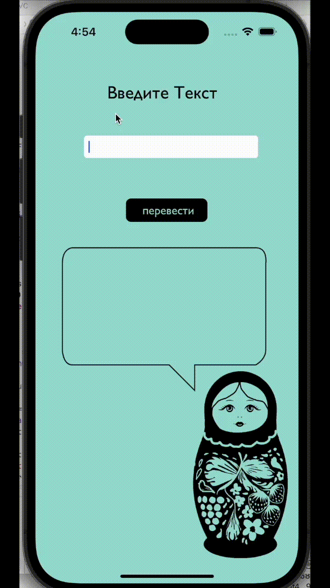

# RNN-Russian-Translator
Machine translation for simple Russian sentences. 
## Demo:

(sentences in demo are novel for the translator) 

## About Data:
The original data I used can be found [here](https://www.manythings.org/anki/)  (click to download rus-en.zip). The text was preprocessed by seperating the Russian and English sentences and removing punctuation and capitalization. The Russian data was then lemmatized to remove unnessecary mophological destinctions that English does not have and tagged for past tense. Both the Russian and English were padded and encoded using the Keras tokenizer and the English sequences were one-hot-encoded.
## About Model:
The actual machine translation model code can be found in the .ipynb file [here](simple_translator.ipynb). 
I used an RNN encoder decoder model with LSTM. The final model has 400 units and uses a Russian vocabulary size of just under 6,000 and an English vocabulary size of around 3,000. The max token size for the Russian input is 10 tokens, and the maximum size of the English output is 5 tokens. 
## About App: 
Using my downloaded trained model and tokenizers, I made a [python program](pythonAPI_to_swift.py) on my local computer for accepting user input and generating a translation. The program then uses fast API to connect to an [iOS app in Swift](SwiftCode/translationVC.swift) , allowing the user to enter text and the translating that text using my model when the user presses translate. 
## Evaluation:
The BLEU score for my model using maximum 2 n-grams was 0.596. Upon visual inspection of the translation of the test set, most appear to be valid translations, however, some contain major mistakes. Use with novel sentences outside of the training and testing data yields mixed results. 
